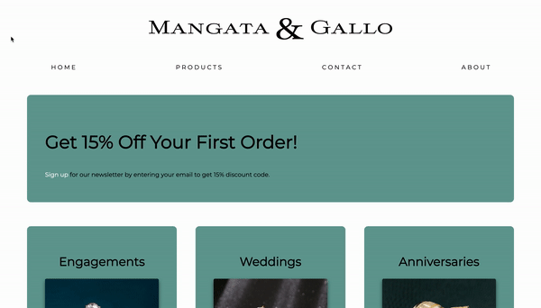

# Web Portfolio Project - Luxury Jewelry: Mangata and Gallo

## Meta Front-End Developer Course
## Created October 18, 2022  

### **Preview**

### **Time spent on project**
3 hours

### **Front End Development**
HTML, CSS

### **How to Run Project**
1. Download HTML, CSS, and images 
2. Open HTML file in browser

### **Summary**
- Created a semantic structure with a header, main content, and footer using CSS Flexbox
- Implemented pseudo-elements (::before and ::after)
- Utilized creativity to create the appropriate look and feel to capture the attention of the client’s target audience
- Added CSS selectors and effects to create the best and appropriate, intentional user engagement

### **LinkedIn**
https://www.linkedin.com/in/mixie-clerard/

### **Email**
clerardm@gmail.com